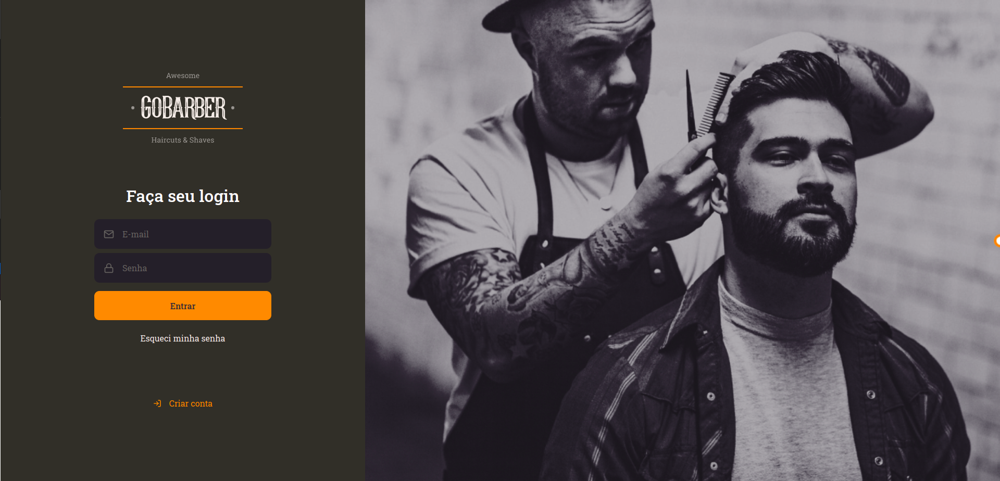
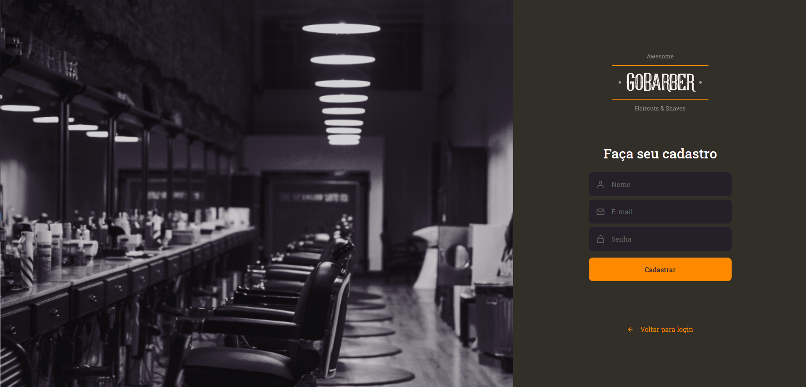
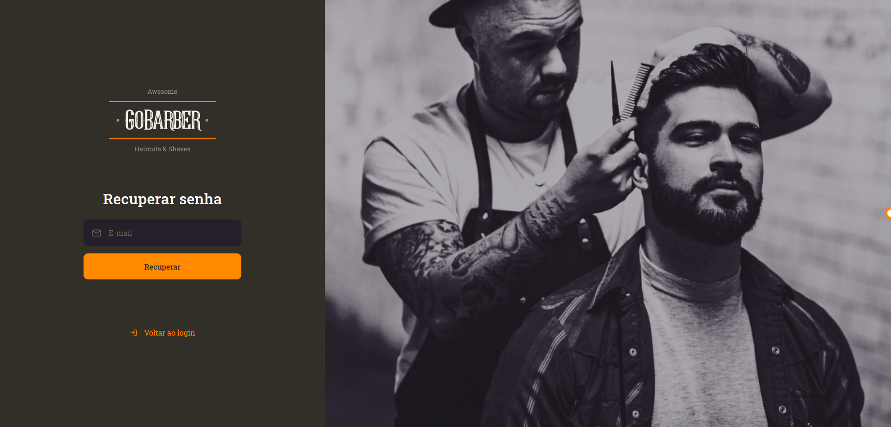
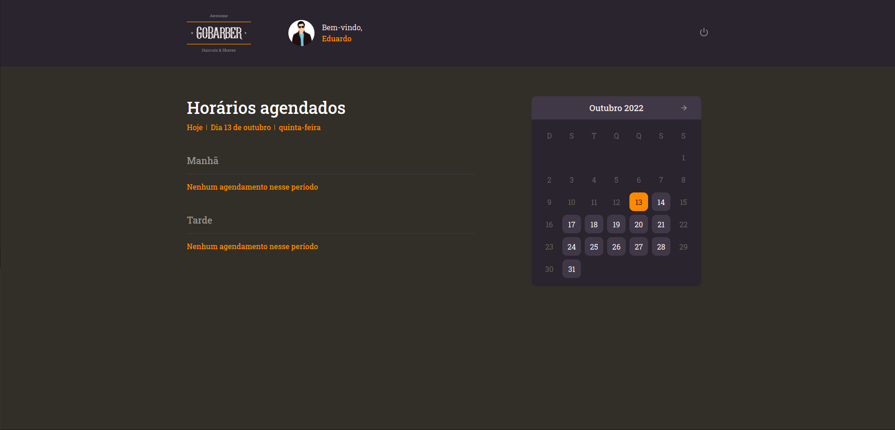
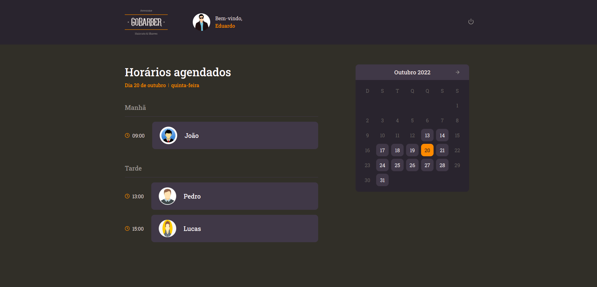
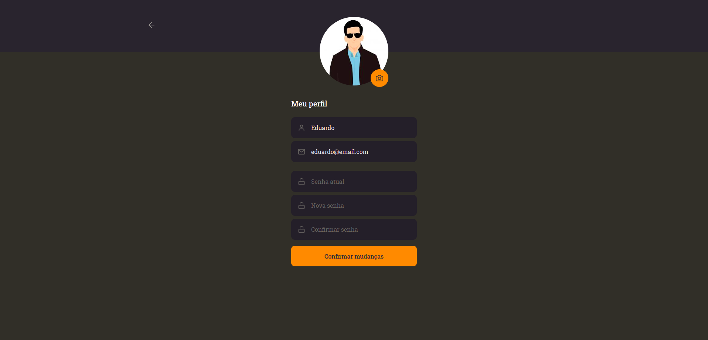

# GoBarber

Projeto utilizando React, desenvolvido no bootcamp GoStack da Rocketseat.

O GoBarber consiste em uma aplicação web para agendamentos de horários em uma barbearia.

## Login

## Create Account

## Forgot Password

## Home

## Profile
